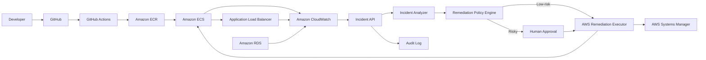

# AWS DevOps Incident & Auto-Remediation Platform

An AI-assisted AWS incident management platform for detecting application and infrastructure incidents, correlating CloudWatch/ECS/ALB/RDS telemetry, generating root-cause analysis, and executing safe policy-controlled remediation.

> Portfolio focus: AWS DevOps, observability, incident response, automation, security, and Infrastructure as Code.

## Architecture



## Core capabilities

- CloudWatch alarm/event ingestion
- ECS, ALB and RDS evidence collection
- Deterministic incident classification and RCA
- Optional LLM-assisted analysis
- Safe remediation allow-list
- Dry-run mode by default
- Human approval for high/critical actions
- Idempotent incident processing
- Audit trail for remediation
- Prometheus-style metrics
- Local mock/demo mode with no AWS account required
- Dockerized development
- Terraform foundation for AWS deployment
- GitHub Actions CI with tests and security scanning

## Incident scenarios

### ECS service unhealthy
Detect rising ALB 5xx responses and unhealthy ECS targets, correlate with recent deployments, then recommend a rollback or restart.

### ECS CPU saturation
Detect sustained CPU spikes, inspect task count and recent deployment activity, then scale within a configured maximum.

### RDS connection pressure
Correlate application errors with database connection metrics and produce a mitigation recommendation.

### EC2 disk pressure
Use SSM diagnostics to identify large log directories and propose a bounded cleanup action.

### Failed deployment
Compare the current task definition/image with the previous healthy revision and recommend rollback after failed health checks.

## Repository structure

```text
.
├── app/
│   ├── api.py
│   ├── config.py
│   ├── models.py
│   ├── analyzer.py
│   ├── policy.py
│   ├── remediation.py
│   ├── evidence.py
│   └── main.py
├── demo/
│   └── incident_ecs_unhealthy.json
├── tests/
│   ├── conftest.py
│   ├── test_analyzer.py
│   ├── test_policy.py
│   └── test_api.py
├── terraform/
│   ├── main.tf
│   ├── variables.tf
│   ├── outputs.tf
│   └── versions.tf
├── .github/workflows/ci.yml
├── Dockerfile
├── docker-compose.yml
├── requirements.txt
└── README.md
```

## Local quick start

```bash
python3 -m venv .venv
source .venv/bin/activate
pip install -r requirements.txt
uvicorn app.main:app --reload
```

Open:

- API docs: `http://127.0.0.1:8000/docs`
- Health: `http://127.0.0.1:8000/health`
- Metrics: `http://127.0.0.1:8000/metrics`

Run tests:

```bash
pytest -q
```

Expected result:

```text
5 passed
```

Run the demo incident:

```bash
curl -X POST http://127.0.0.1:8000/api/v1/incidents/analyze \
  -H 'Content-Type: application/json' \
  --data @demo/incident_ecs_unhealthy.json
```

## Safety model

Remediation is explicitly policy-controlled.

| Action | Default |
|---|---|
| Restart ECS service | Auto allowed |
| Scale ECS service | Auto allowed within max task limit |
| Roll back deployment | Approval required |
| Modify network/security groups | Blocked |
| Modify IAM | Blocked |
| Delete resources | Blocked |

The implementation never treats an LLM response as authority. The policy engine decides what can actually execute.

## Environment variables

```bash
AWS_REGION=ap-south-1
DRY_RUN=true
MAX_SCALE_TASKS=10

# Optional LLM integration
LLM_ENABLED=false
OPENAI_API_KEY=
OPENAI_MODEL=
```

## Docker

```bash
docker compose up --build
```

Then open `http://127.0.0.1:8000/docs`.

## Terraform

The Terraform folder contains a low-cost foundation and example read-only IAM role for the incident platform. Review the trust relationship and permissions before production use.

```bash
cd terraform
terraform init
terraform fmt -check
terraform validate
terraform plan
```

## CI/CD

GitHub Actions runs:

1. Python dependency installation
2. Automated tests
3. Trivy filesystem security scan
4. Container image build

The workflow uses `contents: read` to keep GitHub permissions minimal.

## Production hardening roadmap

- EventBridge/SNS/SQS ingestion
- DynamoDB-backed incident state and idempotency
- CloudWatch Logs Insights queries
- ECS task-definition rollback executor
- SSM Run Command with approval tokens
- Slack/Teams/PagerDuty notifications
- OpenTelemetry trace correlation
- Multi-account AWS Organizations support
- OPA/Cedar policy enforcement
- SBOM, image signing and provenance attestations

## Interview talking points

1. Correlating evidence across CloudWatch, ECS, ALB and RDS.
2. Running deterministic analysis before optional AI reasoning.
3. Using dry-run and approval gates to reduce remediation blast radius.
4. Designing idempotent incident processing.
5. Applying least privilege to AWS remediation.
6. Providing a local mock path before connecting to a live AWS account.
7. Designing incident automation around measurable signals instead of blind LLM actions.

## License

MIT
