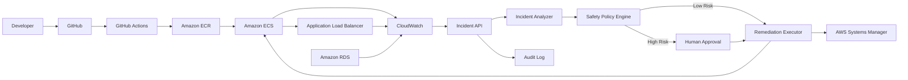

# AWS DevOps Incident & Auto-Remediation Platform

> **An AWS DevOps project that detects incidents, finds the likely cause, and safely recommends or performs remediation.**

This project is designed to demonstrate how a DevOps engineer can build an **automated incident-response system on AWS** instead of manually checking dashboards and logs every time an application fails.

It combines **AWS monitoring + Python/FastAPI + incident analysis + safe automation + Terraform + Docker + GitHub Actions**.

---

## 1. What problem does this solve?

Imagine an application is running on **Amazon ECS**.

Suddenly:

- Users start receiving HTTP 5xx errors.
- ECS tasks become unhealthy.
- CloudWatch shows abnormal metrics.
- A new deployment happened 5 minutes ago.

Normally, a DevOps engineer has to:

1. Open CloudWatch.
2. Check ECS.
3. Check the ALB.
4. Check application logs.
5. Compare the latest deployment.
6. Find the likely root cause.
7. Decide what action to take.
8. Execute the fix.
9. Verify that the service recovered.

This project brings those steps into one workflow.

### Instead of:

`Alert → Engineer investigates → Engineer fixes → Engineer verifies`

### The platform aims for:

`Alert → Collect evidence → Analyze → Apply safety policy → Remediate → Verify`

---

## 2. What does the platform actually do?

At a high level:

`AWS Incident → Evidence Collection → Root Cause Analysis → Remediation Decision → Safe Action`

For example:

> **ECS checkout service becomes unhealthy**

The platform can collect information such as:

- ALB 5xx error rate
- ECS target health
- ECS running/desired task count
- Deployment revision
- CPU utilization
- RDS connection pressure
- Recent incident evidence

It then produces a structured analysis:

```text
Incident: ECS checkout service unhealthy
Severity: HIGH

Evidence:
- ALB 5xx rate: 18.7%
- Unhealthy targets: 3
- Deployment: checkout:v1.8.2
- Previous revision: checkout:v1.8.1

Likely cause:
Health-check/application regression after deployment.

Recommended action:
Restart service or roll back the deployment.

Safety:
Rollback requires human approval.
```

---

## 3. Architecture



### Main flow

**1. Application runs on AWS**

ECS hosts the application.

**2. AWS generates telemetry**

CloudWatch, ALB, ECS and RDS provide operational signals.

**3. Incident reaches the platform**

The Incident API receives the incident and evidence.

**4. Analyzer investigates**

Rules correlate the available evidence and identify a likely cause.

**5. Policy engine evaluates the action**

The platform checks whether the proposed action is safe to execute automatically.

**6. Remediation happens**

Low-risk actions can be simulated or executed.

High-risk actions require approval.

**7. Audit information is retained**

Every decision can be recorded for investigation and compliance.

---

## 4. AWS services used

| AWS Service | Purpose |
|---|---|
| **Amazon ECS** | Run containerized applications |
| **Amazon ECR** | Store Docker images |
| **Application Load Balancer** | Route traffic and expose health information |
| **Amazon CloudWatch** | Metrics, alarms and operational signals |
| **Amazon RDS** | Database monitoring scenario |
| **AWS Systems Manager** | Instance diagnostics/remediation scenario |
| **IAM** | Least-privilege access |
| **EventBridge** | Planned event ingestion |
| **SNS/SQS** | Planned reliable incident delivery |
| **Terraform** | Infrastructure as Code |

---

# 5. Incident scenarios

## Scenario 1 — ECS service becomes unhealthy

### Example

A new application version is deployed.

After deployment:

`ALB 5xx ↑ → ECS targets unhealthy → CloudWatch alarm`

The platform investigates:

- Current deployment
- Previous deployment
- Target health
- Error rate
- Task status

Then it can recommend:

`Restart service`

or:

`Rollback deployment`

Rollback is treated as a higher-risk operation and requires approval.

---

## Scenario 2 — ECS CPU becomes very high

Example:

`CPU = 92%`

The platform checks:

- Current task count
- CPU utilization
- Service health
- Existing scaling limits

It can recommend:

`Scale ECS service`

The policy engine prevents the system from exceeding the configured task limit.

---

## Scenario 3 — RDS connection pressure

Example:

`Database connection utilization = 90%`

The platform can correlate:

- Application errors
- Database connections
- Incident timing
- Recent deployments

Instead of blindly changing the database, it generates a controlled mitigation recommendation.

---

## Scenario 4 — EC2 disk pressure

Example:

`Disk utilization = 94%`

The planned SSM workflow can:

1. Inspect disk usage.
2. Identify large log directories.
3. Produce a cleanup recommendation.
4. Require approval for risky cleanup.
5. Execute only an allow-listed action.
6. Verify the result.

---

## Scenario 5 — Failed deployment

Example:

`Deployment v1.8.2 → health checks fail`

The platform compares:

- Current image/version
- Previous healthy version
- Health-check status
- Error rate
- Incident timing

It can recommend:

`Rollback to previous healthy version`

---

# 6. Safety is a major part of this project

This is **not** designed as an unrestricted AI agent with AWS administrator permissions.

The system follows a controlled model:

`AI/Rules → Policy Engine → Permission Check → Action`

The AI can **recommend** an action, but the policy engine decides whether that action is allowed.

### Current policy

| Action | Risk | Automatic? |
|---|---|---|
| Restart ECS service | Low | Yes |
| Scale ECS service | Medium | Yes, within limit |
| Rollback deployment | High | Approval required |
| Modify security groups | High | Blocked |
| Modify IAM | Critical | Blocked |
| Delete AWS resources | Critical | Blocked |

### Default mode

The project starts with:

`DRY_RUN=true`

That means remediation is **simulated instead of changing AWS resources**.

This makes the project safer to test and demonstrate.

---

# 7. Why use deterministic analysis before AI?

A common mistake in AI-based DevOps automation is allowing an LLM to directly execute infrastructure changes.

This project uses a safer approach:

`AWS Evidence → Deterministic Rules → Optional AI Reasoning → Policy → Remediation`

Deterministic rules handle known situations such as:

- ECS unhealthy targets
- High CPU
- RDS connection pressure

An optional LLM layer can later help summarize logs, correlate complex evidence and explain the incident in human-readable language.

**The LLM does not receive unrestricted authority to modify AWS.**

---

# 8. Repository structure

```text
AWS-DevOps-Incident-Auto-Remediation-Platform/
│
├── app/
│   ├── api.py
│   ├── analyzer.py
│   ├── config.py
│   ├── evidence.py
│   ├── main.py
│   ├── models.py
│   ├── policy.py
│   └── remediation.py
│
├── demo/
│   └── incident_ecs_unhealthy.json
│
├── tests/
│   ├── test_analyzer.py
│   ├── test_api.py
│   └── test_policy.py
│
├── terraform/
│   ├── main.tf
│   ├── outputs.tf
│   ├── variables.tf
│   └── versions.tf
│
├── .github/
│   └── workflows/
│       └── ci.yml
│
├── Dockerfile
├── docker-compose.yml
├── requirements.txt
├── .env.example
└── README.md
```

---

# 9. Technology stack

### Cloud

- AWS ECS
- AWS ECR
- AWS ALB
- AWS CloudWatch
- AWS RDS
- AWS Systems Manager
- AWS IAM

### DevOps

- Docker
- Terraform
- GitHub Actions
- Git
- CI/CD

### Application

- Python
- FastAPI
- Pydantic
- boto3

### Observability

- CloudWatch
- Prometheus metrics

### Security

- IAM least privilege
- Dry-run mode
- Remediation allow-list
- Approval gates
- Trivy security scanning

---

# 10. Run locally

You do **not** need an AWS account to understand the basic workflow.

## Step 1 — Clone

```bash
git clone https://github.com/RahulSinha9/AWS-DevOps-Incident-Auto-Remediation-Platform.git
cd AWS-DevOps-Incident-Auto-Remediation-Platform
```

## Step 2 — Create virtual environment

```bash
python3 -m venv .venv
source .venv/bin/activate
```

## Step 3 — Install dependencies

```bash
pip install -r requirements.txt
```

## Step 4 — Start API

```uvicorn app.main:app --reload
```

Open:

- API documentation: `http://127.0.0.1:8000/docs`
- Health: `http://127.0.0.1:8000/health`
- Metrics: `http://127.0.0.1:8000/metrics`

---

# 11. Run the automated tests

```bash
pytest -q
```

The tests cover:

- Incident analysis
- ECS unhealthy detection
- CPU-based analysis
- Remediation policy
- API health
- Incident API

---

# 12. Test an incident manually

Start the API:

```bash
uvicorn app.main:app --reload
```

Then:

```bash
curl -X POST http://127.0.0.1:8000/api/v1/incidents/analyze \
  -H "Content-Type: application/json" \
  --data @demo/incident_ecs_unhealthy.json
```

The response contains:

- Incident severity
- Likely cause
- Confidence
- Evidence
- Recommended action
- Whether approval is required
- Remediation result

---

# 13. Run with Docker

Build and start:

```bash
docker compose up --build
```

Then open:

`http://127.0.0.1:8000/docs`

Stop:

```bash
docker compose down
```

---

# 14. Environment variables

Example:

```bash
AWS_REGION=ap-south-1
DRY_RUN=true
MAX_SCALE_TASKS=10

LLM_ENABLED=false
OPENAI_API_KEY=
OPENAI_MODEL=
```

### Important

Never commit:

- AWS access keys
- Secret keys
- API keys
- Database passwords
- Production credentials

Use IAM roles, GitHub OIDC, AWS Secrets Manager or another secure secret-management mechanism.

---

# 15. Terraform

The Terraform directory provides the initial AWS IAM foundation.

Run:

```bash
cd terraform

terraform init
terraform fmt -check
terraform validate
terraform plan
```

Review IAM trust relationships and permissions before applying anything to a production account.

---

# 16. CI/CD pipeline

GitHub Actions performs:

`Code → Tests → Security Scan → Docker Build`

Current pipeline includes:

1. Checkout source
2. Install Python
3. Install dependencies
4. Run pytest
5. Run Trivy filesystem security scan
6. Build Docker image

GitHub permissions are kept minimal with:

`contents: read`

---

# 17. Production architecture roadmap

The current repository is the foundation. The next implementation stages can add real AWS automation.

### Phase 1 — Incident ingestion

`CloudWatch/EventBridge → SQS → Incident API`

### Phase 2 — Better evidence collection

Add:

- CloudWatch Logs Insights
- ECS task logs
- ALB metrics
- RDS metrics
- Deployment history

### Phase 3 — Real remediation

Add controlled executors for:

- ECS restart
- ECS scaling
- ECS rollback
- SSM diagnostics

### Phase 4 — Human approval

Integrate:

- Slack
- Microsoft Teams
- PagerDuty
- Approval tokens

### Phase 5 — AI RCA

Add an LLM layer for:

- Log summarization
- Cross-service correlation
- Root-cause explanation
- Incident summaries

### Phase 6 — Enterprise features

Add:

- Multi-account AWS support
- DynamoDB incident state
- OpenTelemetry
- OPA/Cedar policies
- SBOM
- Image signing
- Audit dashboards

---

# 18. Example final incident report

A future production version could generate:

```text
====================================================
AWS INCIDENT REPORT
====================================================

Incident ID: INC-2026-001
Service: checkout
Severity: HIGH

SYMPTOM
ECS checkout service became unhealthy.

EVIDENCE
- ALB 5xx: 18.7%
- Unhealthy targets: 3/4
- Current version: v1.8.2
- Previous version: v1.8.1
- CPU: 62%

TIMELINE
14:01  Deployment v1.8.2 started
14:04  Target health degraded
14:05  ALB 5xx increased
14:06  Incident detected

LIKELY ROOT CAUSE
Application/health-check regression introduced
during the latest deployment.

RECOMMENDED ACTION
Rollback to v1.8.1.

SAFETY
Rollback requires human approval.

STATUS
Waiting for approval.
====================================================
```

---

# 19. What makes this a strong DevOps project?

This project demonstrates more than simply deploying an application.

It combines:

- **AWS architecture**
- **Monitoring**
- **Incident management**
- **Root-cause analysis**
- **Automation**
- **Infrastructure as Code**
- **CI/CD**
- **Docker**
- **Security**
- **IAM**
- **Python development**
- **Production-style safety controls**

The important engineering concept is:

> **Automate repetitive operations without giving automation unlimited permissions.**

---

# 20. Resume description

### AWS DevOps Incident Management & Auto-Remediation Platform

**Tech:** AWS ECS, ECR, ALB, CloudWatch, RDS, IAM, SSM, Python, FastAPI, Docker, Terraform, GitHub Actions

> Built an AI-assisted AWS incident management platform that correlates CloudWatch, ECS, ALB and RDS signals to identify likely root causes and recommend policy-controlled remediation. Implemented dry-run execution, risk-based approval gates, automated incident analysis, Docker deployment, Terraform-based IAM provisioning and CI security scanning.

---

# 21. Interview questions this project can demonstrate

### AWS

- How does ECS service health work?
- How would you troubleshoot ALB 5xx errors?
- How would you investigate an unhealthy ECS target?
- How would you monitor RDS?
- How would you design IAM permissions for remediation?

### DevOps

- How would you design a self-healing system?
- How do you prevent an automation loop?
- Why is idempotency important?
- How would you implement rollback?
- How would you design incident escalation?

### Terraform

- How do you manage IAM using Terraform?
- How do you separate environments?
- How do you protect Terraform state?

### Docker

- How do you build a secure container?
- Why should containers run as non-root?
- How do you scan container dependencies?

### AI/Automation

- Why shouldn't an LLM directly modify production infrastructure?
- How do you validate AI-generated remediation?
- How do you reduce the blast radius of automated actions?

---

# 22. Current status

This repository is the **foundation version** of the platform.

The recommended implementation path is:

```text
Foundation
   ↓
Real AWS telemetry
   ↓
Incident ingestion
   ↓
RCA engine
   ↓
Safe remediation
   ↓
Human approval
   ↓
AI-assisted RCA
   ↓
Production hardening
```

The goal is to build the project incrementally and demonstrate each DevOps concept with a working implementation rather than claiming functionality that has not been implemented yet.

---

## License

MIT
